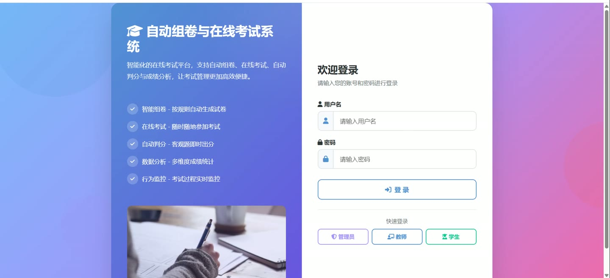
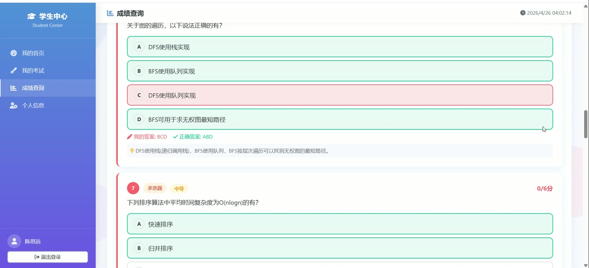
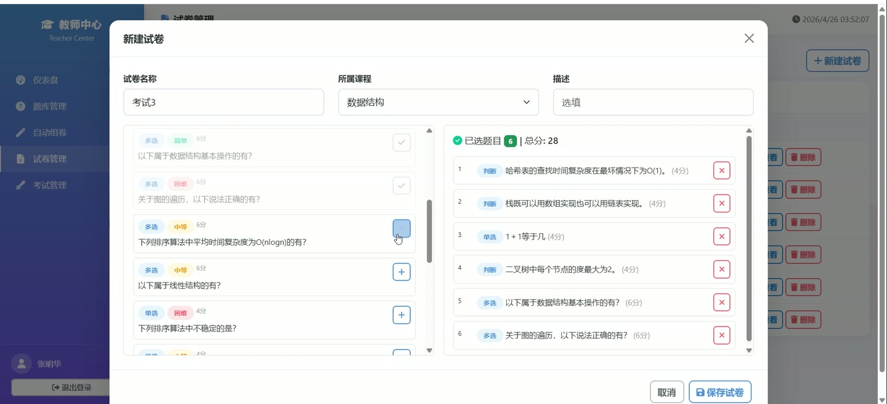
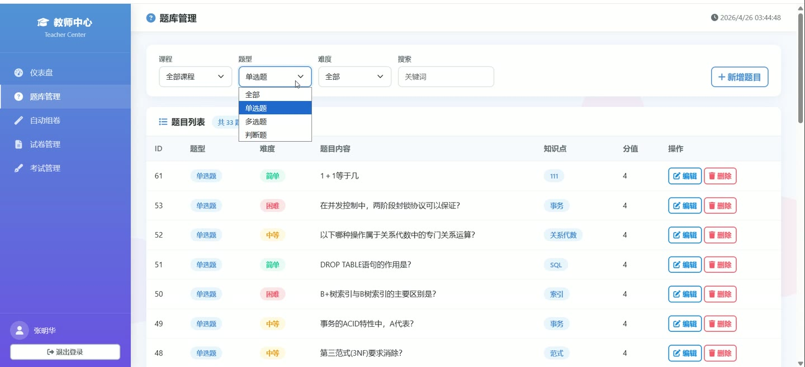
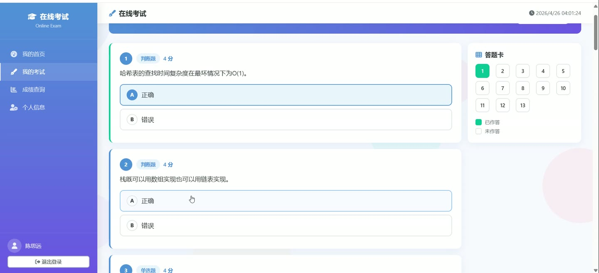

# (附文档)Python+MySQL Flask的自动组卷与在线考试系统

**技术栈**：Python、Flask、MySQL

### 系统简介

本系统是一套基于 Python Flask 与 MySQL 构建的自动组卷与在线考试平台，采用前后端分离架构，后端提供 RESTful API 与页面路由，前端通过模板渲染与接口交互。系统包含管理员、教师、学生三类角色，覆盖题库管理、自动组卷、考试发布、在线答题、行为监控、自动判分与成绩分析等完整业务闭环。
 
### 核心功能
 
### 管理员端

- 查看管理后台总览，统计用户、班级、课程、考试等核心数据。

- 用户管理：查看用户列表，按角色筛选，新增、编辑、删除用户，设置用户名、真实姓名、角色、邮箱、手机号及启用状态。

- 班级管理：查看班级列表，新增班级并填写班级名称与描述，维护班级基础信息。

- 课程管理：查看课程列表，新增课程并指定课程名称、描述与授课教师。

- 数据统计：查看平台整体数据概览，掌握用户、课程、题目与考试分布情况。

- 登录日志：查看用户登录记录，包含用户名、登录时间与 IP 地址。

- 文件上传：支持上传 png、jpg、jpeg、gif、bmp、webp 格式图片，用于头像等资源。

- 账号状态控制：通过 status 字段启用或禁用用户账号，禁用后无法登录。
 
### 教师端

- 查看教师工作台，汇总本人课程、题库、试卷与考试数据。

- 题目管理：维护单选、多选、判断三类题目，设置题干、选项 A-D、答案、解析、分值、难度、知识点与所属课程。

- 自动组卷：按题型、难度、知识点、课程等条件从题库中自动抽题生成试卷，支持设置各题型数量与分值。

- 试卷管理：查看试卷列表，维护试卷名称、描述、总分、所属课程与启用状态。

- 试卷详情：查看试卷内题目组成，调整题目排序与单题分值，核对试卷总分。

- 考试管理：创建考试并绑定试卷，设置考试名称、开始时间、结束时间、考试时长与参与班级。

- 考试监控：实时查看指定考试的考生状态，包括未开始、进行中、已提交、自动提交等。

- 在线判分：对指定考试的学生答卷进行批阅，核对客观题得分并确认最终成绩。

- 成绩分析：查看指定考试的成绩统计与题目作答分析，掌握整体掌握情况。

- 考试行为记录：查看考生在考试过程中的切屏、复制、粘贴等行为日志。
 
### 学生端

- 查看学生工作台，汇总待参加考试、已完成考试与成绩信息。

- 考试列表：查看本人可参加的考试，显示考试名称、时间范围、时长与状态。

- 在线答题：进入指定考试作答，支持单选题、多选题、判断题的作答与答案保存。

- 自动提交：考试时间到达后系统自动提交答卷，状态记录为自动提交。

- 成绩查询：查看本人历次考试成绩与得分情况。

- 个人中心：查看与维护个人资料，包括真实姓名、邮箱、手机号与头像。

- 行为上报：考试过程中切屏、复制、粘贴等操作会被记录并上报至行为日志。

- 登录记录：登录成功后系统自动记录登录时间与 IP 地址。
 
### 技术栈

后端框架Python + Flask
ORMFlask-SQLAlchemy
权限控制Session 会话 + login_required / role_required 装饰器
数据库MySQL（utf8mb4）
数据库驱动PyMySQL
前端模板Jinja2 模板渲染
接口风格RESTful API（JSON 响应）
密码加密MD5
文件上传Flask 文件上传 + 本地 uploads 目录
 
### 交付内容

- 后端完整源码

- 前端完整源码

- 数据库初始化脚本

- 万字文档

## 界面展示

---

## 获取完整源码 + 万字文档

本仓库为项目介绍页。**完整前后端源码、数据库初始化脚本、万字项目文档**，请加微信 `kangkangcode`，或访问 [codekk.top](http://codekk.top) 获取。

可作课程设计 / 毕业设计参考，支持远程部署调试。